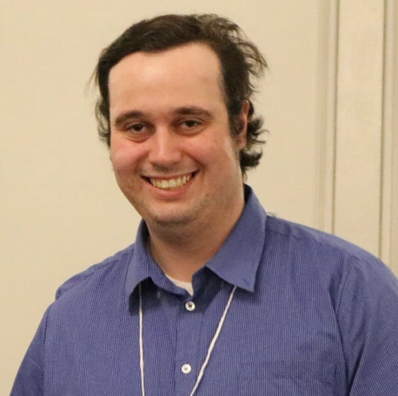

### Hi there 👋

My name is Will Taylor-Melanson. I'm a 1st year MSc student at Dalhousie University in Halifax, Canada.
I work as a software developer on the AI/ML team at Thinking Big, Inc. in Charlottetown, Prince Edward Island, Canada.
My research interests include Deep Learning applied to sequence processing and wearable interactive systems.
My personal interests include competitive programming (mostly on [kattis](https://open.kattis.com/)) and
deep learning visualization techniques.

- 📫   Reach me by email: wtaylor@upei.ca or wl647481@dal.ca

